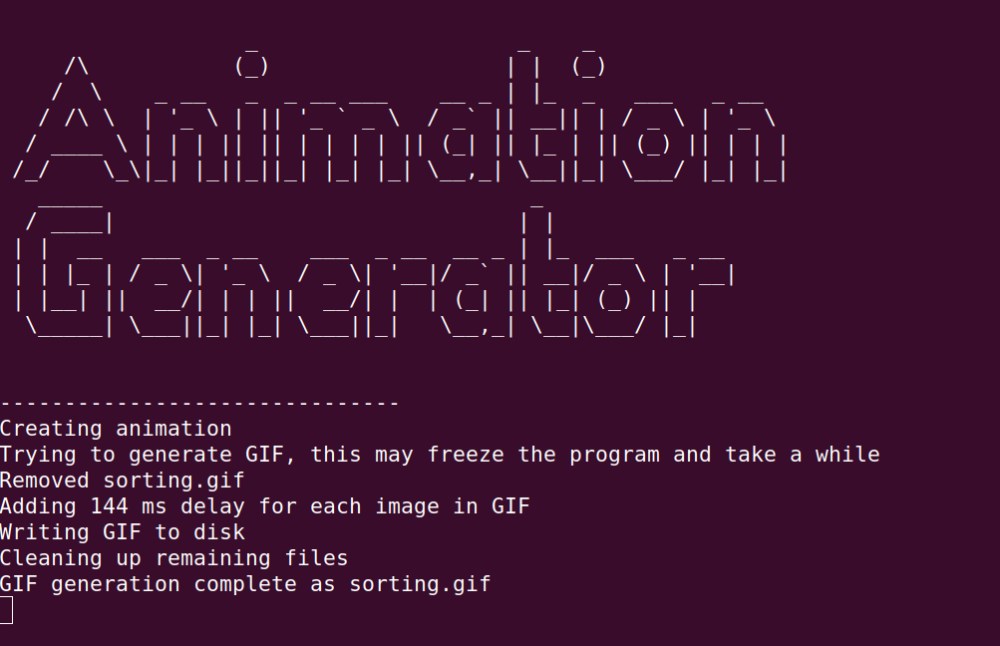

# Sorting-Algorithms-GIF-Generator

Originally created by LucasPilla, this is a fork of his project "Sorting Algorithms Visualizer" that instead generates GIF files of sorting animations written entirely in python3. Additional options are implemented to create better GIFs.

Original project: https://github.com/LucasPilla/Sorting-Algorithms-Visualizer

Program made with Python and Pygame module for generating GIFs of sorting algorithms \
Support this project by leaving a :star:

## Program preview

## Contribute
Contributions are welcome. This project is still very new so much work is needed.
:exclamation: Feel free to open an issue if you have some problem :exclamation:

## Using the application
Right now only tested in Ubuntu x64 22.04.1-desktop
### Installation
- Clone GitHub repository `git clone https://github.com/thestar19/Sorting-Algorithm-GIF-Generator.git`
- Install requirements: `pip3 install -r requirements.txt`
- Run: `python3 src/main.py`
### Verbose mode
- To output extra info, run `python3 src/main.py -v`
- To see further information about the program, run `python3 src/main.py help`
### Terminal mode
To generate an animation without interacting with the program's graphical interface:
- Run eg `python3 src/main.py -f GIF -s 50 -d 50 -l 0 -a quick`
  
This will create a GIF in the main folder of Quicksort sorting an array of 50 elements with a delay for each pic of 50ms and infinite looping.\
To see all options, run `python3 src/main.py help`
### Benchmark
To better optimize the program & to enable features such as "estimated time for creation", a benchmark exists.
You can contribute too:
- Install the program so that `python3 src/main.py` runs correctly
- Run `python3 src/benchmark.py -standard true -atl true`. This may take a while (10min is common on modern computers) \
    The results will be appended to benchmark_results.txt, which contains results from other systems.
- Upload your results to [benchmark_results.txt](benchmark_results.txt) in the repo, either by manually copying and pasting the results into the file on the repo or by simply uploading the complete file.

To see all options for the benchmark, run `python3 src/benchmark.py help`

## Common troubleshooting steps:
### Install pip
For ubuntu: sudo apt-get update\
            sudo apt-get upgrade\
            sudo apt-get install pip3

### Multiple python installs
Check what version of python runs:\
  python3 -V\
  python3.7 -V
  
Then, install imageio & pillow manually\
  python3.7 -m pip install imageio\
  python3.7 -m pip install --upgrade imageio\
  python3.7 -m pip install pillow\
  python3.7 -m pip install --upgrade pillow
