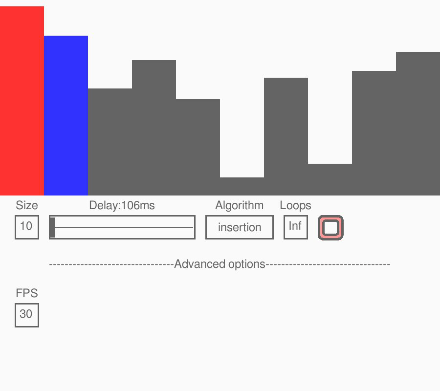

# Sorting-Algorithms-GIF-Generator

Originally created by LucasPilla, this is a fork of his project "Sorting Algorithms Visualizer" that instead generates GIF files of sorting animations written entirely in python3. Additional options are implemented to create better GIFs.

Original project: https://github.com/LucasPilla/Sorting-Algorithms-Visualizer

Program made with Python and Pygame module for generating GIFs of sorting algorithms \
Support this project by leaving a :star:

## Program preview

## Contribute
Contributions are welcome. This project is still very new so much work is needed.
:exclamation: Feel free to open an issue if you have some problem :exclamation:

## Using the application
Right now probably limited to Linux
- Clone GitHub repository `git clone https://github.com/thestar19/Sorting-Algorithm-GIF-Generator.git`
- Install requirements: `pip3 install -r requirements.txt`
- Run: `python3 src/main.py`

## Common troubleshooting steps:
### Install pip
For ubuntu: sudo apt-get update\
            sudo apt-get upgrade\
            sudo apt-get install pip3

### Multiple python installs
Check what version of python runs:\
  python3 -V\
  python3.7 -V
  
Then, install imageio & pillow manually\
  python3.7 -m pip install imageio\
  python3.7 -m pip install --upgrade imageio\
  python3.7 -m pip install pillow\
  python3.7 -m pip install --upgrade pillow
